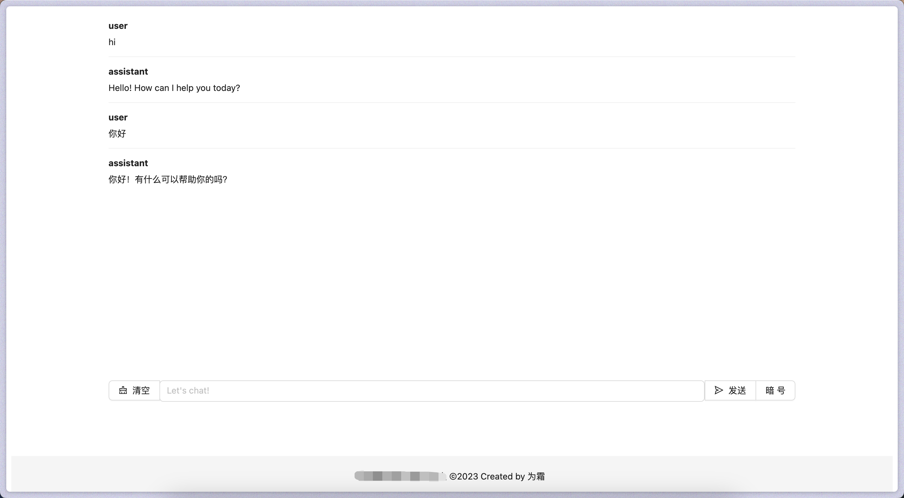

# gptbot backend

- Single executable file
- Supports authorization via HTTP header

## Build

1. `git clone https:github.com/shwezhu/gptbot.git`
2. `cd gptbot/backend`
3. `go install .`
4. run `gptbot` in your terminal:

```bash
$go build -o server
```

## Usage

```bash
$./server -h
Usage of ./server:
-c string
    path to SSL certificate
-k string
    path to SSL private key
-m string
    default gpt model to use (default "gpt-3.5-turbo")
-p string
    listen port (default ":8080")
-t string
    authorization token for the API

# listen on port 2096 with TLS
$./server -t raven1011 -c ~/tls/cert.pem -k ~/tls/cert.key -p 2096
```

```shell
❯ curl shaowenzhu.top:2096/api/chat \
  -H "Content-Type: application/json" \
  -H "Authorization: raven1011" \
  -d '{
    "messages": [
      {
        "role": "system",
        "content": "You are a helpful assistant."
      },
      {
        "role": "user",
        "content": "你好"
      }
    ]
  }'
{"role":"assistant","content":"你好！有什么我可以帮助你的吗？"}
```

## API

**POST /api/chat**

Headers: `Authorization: <USER_TOKEN>`

Request Body:
    
```json
{
"messages": [
    {
    "role": "system",
    "content": "You are a helpful assistant."
    },
    {
    "role": "user",
    "content": "hello, tell me a joke."
    }
]
}
```

Response:

```json
{
    "role":"<string>",
    "content":"<string>"
}
```

Or error:

```json
{
    "error": "<string>"
}
```

# gptbot frontend

