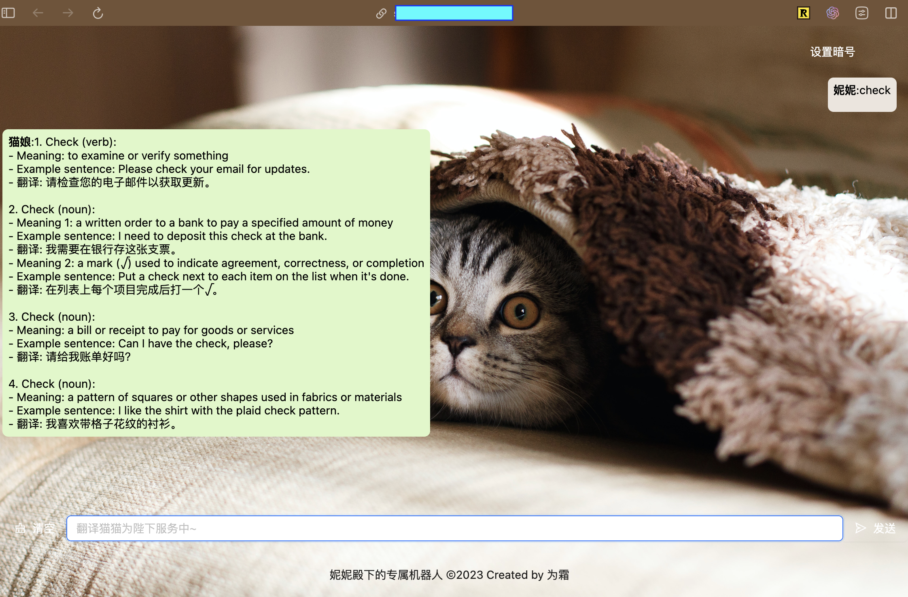

# gptbot backend

Some countries have blocked the access to ChatGPT, run this gptbot on a server from a country that has not blocked the access to ChatGPT. Then you can use this gptbot as a proxy to access ChatGPT.

- Single executable file
- Supports authorization via HTTP header

## Requirements

- Get your own OpenAI API Key at https://platform.openai.com/docs/overview
- Have a server running in a country that has not blocked the access to ChatGPT

## Why not use VPN, SOCKS or HTTP proxy 

 With proxy server (VPN, SOCKS) you need additional configuration at client side, and it's not easy to use for non-technical users. And HTTP proxy have blocked by some countries. With this gptbot, you can make http request to it from anywhere without any additional setting at client side unless your server IP is blocked by the your country.

## Build

1. `git clone https:github.com/shwezhu/gptbot.git`
2. `cd gptbot/backend`
3. `go install .`
4. run `gptbot` in your terminal:

```bash
$go build -o server
```

## Usage

Set environment variable at `.zshrc` or `.bashrc`: `export OPENAI_API_KEY=YOUR_API_KEY`

```bash
$./server -h
Usage of ./server:
-c string
    path to SSL certificate
-k string
    path to SSL private key
-m string
    default gpt model to use (default "gpt-3.5-turbo")
-p string
    listen port (default ":8080")
-t string
    authorization token for the API

# listen on port 8080 with TLS
$./server -t raven1011 -c ~/tls/cert.pem -k ~/tls/cert.key -p 8080
```

```shell
❯ curl example.com:8080/api/chat \
  -H "Content-Type: application/json" \
  -H "Authorization: raven1011" \
  -d '{
    "messages": [
      {
        "role": "system",
        "content": "You are a helpful assistant."
      },
      {
        "role": "user",
        "content": "你好"
      }
    ]
  }'
{"role":"assistant","content":"你好！有什么我可以帮助你的吗？"}
```

## API

**POST /api/chat**

Headers: `Authorization: <USER_TOKEN>`

Request Body:
    
```json
{
"messages": [
    {
    "role": "system",
    "content": "You are a helpful assistant."
    },
    {
    "role": "user",
    "content": "hello, tell me a joke."
    }
]
}
```

Response:

```json
{
    "role":"<string>",
    "content":"<string>"
}
```

Or error:

```json
{
    "error": "<string>"
}
```

# gptbot frontend



## Deploy

Learn more: [Vite & Deployment - React - David's Blog](https://davidzhu.xyz/post/frontend/react/001-vite-deploy/)